  

  

  
  
  

  

<!-- 01 postcard -->

<table>
<tr>
<td width="58%" valign="top">

</td>
<td width="42%" valign="top">

  

I am **Mubeen**. I write software in Pakistan, usually with a cup of tea going cold beside the keyboard and a small imaginary dragon who is allowed to burn the drafts that should not ship.

I care about the relationship between a clear interface, a honest service contract, a data model that answers real questions, and the operational story that keeps all of it alive after the first demo.

The atelier is the metaphor on purpose. Not a cockpit. Not a void. A desk, a window, and work you can keep.

</td>
</tr>
</table>

  

<!-- 02 dragon -->

  

  

The dragon is the house mascot. He is pixelated on purpose. He breathes fire when a commit is clean, then sits down for tea. He is not a HUD, a sigil, or a neural overlay. He is a creature on a hill.

  

  

<!-- 03 about -->

## The desk

I prefer small, testable systems with explicit boundaries. The strongest work I do sits between research and something a person can actually operate: an algorithm that becomes a product surface, a systems idea that becomes a service, a visual experiment that becomes a tool.

<table>
<tr>
<td width="25%" align="center">

**Product engineering**
 
Interfaces and systems that feel like one piece from the first click to the long maintenance.

</td>
<td width="25%" align="center">

**Applied intelligence**
 
Useful models with evaluation, oversight, and the courage to stay small.

</td>
<td width="25%" align="center">

**Full-stack delivery**
 
Comfortable from the type on a button to the contract behind it.

</td>
<td width="25%" align="center">

**Systems with manners**
 
Foundations that remain understandable after the original author has gone for tea.

</td>
</tr>
<tr>
<td align="center">

**Backend reliability**
 
Clear contracts, boring operations, fewer surprises.

</td>
<td align="center">

**Problem solving**
 
Turning a foggy problem into the next useful decision.

</td>
<td align="center">

**Building in public**
 
Leaving a repository kinder than I found it.

</td>
<td align="center">

**Continuous craft**
 
Following the tools that change how software is made, without worshipping them.

</td>
</tr>
</table>

### How I got here

| | |
|---|---|
| **01** | A borrowed laptop, a blinking cursor, and the discovery that a careful instruction can make a machine do something kind. |
| **02** | Early projects taught the durable lessons: make the first version small, learn from its failures, come back with sharper questions. |
| **03** | The first products used by other people made the work more serious, and much more rewarding. |
| **04** | Machine learning and agentic systems became a natural extension of product work: software that can hold context, help people decide, and remain accountable. |
| **Now** | Autonomous and agent-assisted loops that plan, act, recover, and still answer to a human. The dragon is only allowed to burn the drafts. |

> Complexity is a cost. The goal is not to look sophisticated. It is to be dependable, legible, and still pleasant to open six months later.

  

<!-- 04 toolkit -->

## Pins on the workbench

  

<table>
<tr>
<td width="50%" valign="top">

</td>
<td width="50%" valign="top">

</td>
</tr>
</table>

  &nbsp;
  &nbsp;
  &nbsp;
  &nbsp;
  &nbsp;
  &nbsp;
  
   
  &nbsp;
  &nbsp;
  &nbsp;
  &nbsp;
  &nbsp;
  &nbsp;
  

  

  

<!-- 05 selected work -->

## Selected work

These are things I have actually built: labor logistics, retail stock, hospital operations, city-scale thinking, nostalgic games, a wireless cursor, and a few tools I needed at the desk.

| Repository | What it is |
|---|---|
| [Haazir](https://github.com/muxby/Haazir) | A TypeScript product for matching multi-purpose labor with the work that needs doing. |
| [Retail Asset Tracker](https://github.com/muxby/Retail-Asset-Tracker) | Stock availability, sales, and the unglamorous truth of a shop floor. |
| [Ivor Paine Hospital](https://github.com/muxby/ivor-paine-hospital) | A PHP hospital dashboard: rooms, people, and the paperwork between them. |
| [CITY-MIND](https://github.com/muxby/CITY-MIND) | An artificial intelligence project about how a city might notice itself. |
| [SMART-CITY-ISB](https://github.com/muxby/SMART-CITY-ISB) | A C++ take on civic systems, closer to the metal than the slide deck. |
| [Mobile Cursor](https://github.com/muxby/Mobile_Cursor) | A gyroscopic air mouse: pairing, ballistics, and more than one monitor. |
| [Chrono Rift](https://github.com/muxby/Chrono-rift) | A nostalgic C++ game about processes, signals, scheduling, and the joy of a well-timed jump. |
| [Sonic Heroes OOP](https://github.com/muxby/Sonic-Heroes-OOP) | Object-oriented game systems, written until they behaved. |
| [Buzz Bomber](https://github.com/muxby/Buzz-Bomber) | A small action game. Sometimes the atelier just wants to fly. |
| [Pakistan CPI network](https://github.com/muxby/Pakistan-Temporal-Network-Analysis-CPI-) | Temporal network analysis on prices: the quiet mathematics of a household budget. |
| [GPA calculator](https://github.com/muxby/fast_gpa_calculator) | A small Python utility that should have existed the night before results. |
| [P52 fan control](https://github.com/muxby/Lenovo-P52-GPU_FAN_CONTROL) | A laptop that ran hot, and a Python script that learned to be polite to it. |

### What I look for in a project

- A person on the other side of the screen who will have to live with the result.
- A boundary I can explain without a whiteboard.
- Room for a second version that is smaller than the first, not larger.
- At least one joke the dragon is allowed to keep.

  

  

<!-- 06 garden and trail -->

## The skill garden

Not a dashboard. Not an equalizer. A row of plants I actually water.

  

Python is the soil. TypeScript is the trellis. React is the window. C++ is the stone path that still works in the rain. Postgres is the cellar. Docker is the shed. PyTorch is the greenhouse that needs the door left ajar.

  

The trail is a direction of travel, not a checklist and not a metro map. I have walked fundamentals, the web platform, backends, and cloud. I am on the agentic stretch now. Rust is further up the hill, past a cottage I have not earned yet.

  

<!-- 07 currently -->

## Now brewing

<table>
<tr>
<td width="33%" align="center">
  
</td>
<td width="33%" align="center">
  
</td>
<td width="33%" align="center">
  
</td>
</tr>
</table>

I am currently interested in multi-agent systems that can critique code, evaluate a plan, and offer a useful review before the work reaches a human teammate. The aim is not novelty. It is a more thoughtful development process: slower where it should be slow, faster where the kettle is already boiling.

### On the stove this season

- Agents that can read a repository the way a careful reviewer does, not the way a search box does.
- Local tools with manners: they ask, they show their work, they stop.
- Evaluation that a skeptic would still respect.
- Interfaces that feel like paper and wood, even when the engine is a model.

  

  

<!-- 08 companions -->

## House companions

The fox keeps the dragon honest. The snail sets the pace. The koi refuse to be rushed. The lantern stays on when the commit is not yet kind.

  

If you have been here before, you may remember a pixel fox with a black rectangle behind it. That was a previous color mistake. The fox now lives on paper, like everyone else in the house.

### A few house rules

- No neon. The dusk outside the window is peach and sage, not magenta.
- No more charts for the sake of looking like a dashboard. If a plant can say it, plant it.
- Motion should feel like steam, fireflies, a lid bouncing, a tail, a breath of fire. Not a scanline.
- Text sits on cream. Ink is walnut. If you cannot read it, the pin is in the wrong place.
- The dragon may scorch a draft. He may not scorch a person.

  

<!-- 09 snake -->

## The other creature in the garden

A snake still eats the contribution graph. It is a creature, not a telemetry deck.

  

  If the snake is missing, the garden workflow has not run yet. The dragon is patient.

  

<!-- 10 quote and close -->

## Pressed in the page

  

### A longer version of the same thought

Build something this week that a future teammate will be glad still exists. Make the name of the function obvious. Leave the edge case in a comment only if the code cannot carry it. Prefer a boring database. Prefer a warm light. Prefer a dragon who knows when to stop breathing fire.

I want my repositories to feel like a room someone can enter without taking their shoes off in fear. The wax seal is a joke, and also a standard: if it is not worth stamping, it is not worth shipping.

<table>
<tr>
<td width="50%" align="center">

 
the workshop door

</td>
<td width="50%" align="center">

 
the quieter hallway

</td>
</tr>
</table>

  

If you are building something slow and useful, say hello. The kettle takes a minute. The lantern is already on.

  
   
  <blockquote>Build something this week that your future self and the people who work with you will be glad exists.</blockquote>

  

  Thanks for stopping by the sill. Mind the fire. There are biscuits.

