

<!-- 01 intro -->

**Mubeen** &mdash; software engineer in Pakistan.

Currently building agentic systems that review work before a human has to.

<!-- /01 intro -->

<!-- 02 dragon -->



<!-- 03 stack -->

<h3 align="center">STACK</h3>

 

&nbsp;
&nbsp;
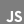&nbsp;
&nbsp;
&nbsp;
&nbsp;

 
&nbsp;
&nbsp;
&nbsp;
&nbsp;
&nbsp;
&nbsp;

 

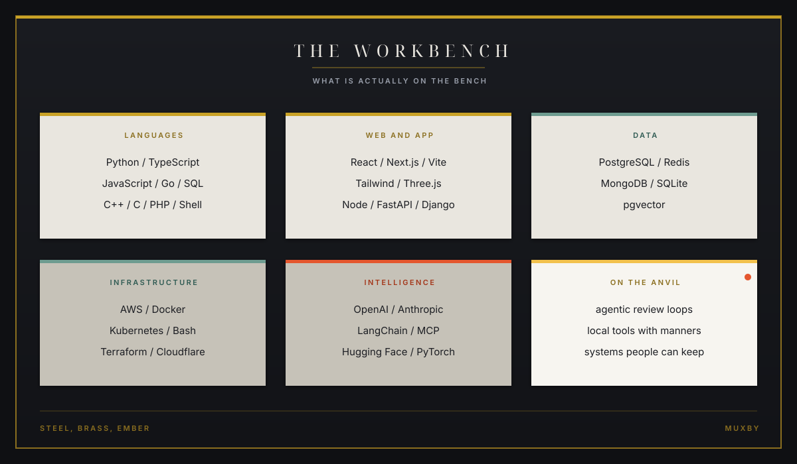

<!-- 04 roadmap -->

<h3 align="center">ROADMAP</h3>



<!-- 05 work -->

<h3 align="center">SELECTED WORK</h3>

<table align="center">
<tr><th align="left">Repository</th><th align="left">What it is</th></tr>
<tr><td align="left"><a href="https://github.com/muxby/Haazir">Haazir</a></td><td align="left">TypeScript app matching multi-purpose labor with the work that needs doing.</td></tr>
<tr><td align="left"><a href="https://github.com/muxby/Retail-Asset-Tracker">Retail Asset Tracker</a></td><td align="left">Stock availability, sales, and shop-floor reality.</td></tr>
<tr><td align="left"><a href="https://github.com/muxby/ivor-paine-hospital">Ivor Paine Hospital</a></td><td align="left">PHP hospital dashboard: rooms, people, paperwork.</td></tr>
<tr><td align="left"><a href="https://github.com/muxby/CITY-MIND">CITY-MIND</a></td><td align="left">AI project on how a city might notice itself.</td></tr>
<tr><td align="left"><a href="https://github.com/muxby/SMART-CITY-ISB">SMART-CITY-ISB</a></td><td align="left">Civic systems in C++, closer to the metal.</td></tr>
<tr><td align="left"><a href="https://github.com/muxby/Mobile_Cursor">Mobile Cursor</a></td><td align="left">Gyroscopic air mouse: pairing, ballistics, multi-monitor.</td></tr>
<tr><td align="left"><a href="https://github.com/muxby/Chrono-rift">Chrono Rift</a></td><td align="left">C++ game built on processes, signals, and scheduling.</td></tr>
<tr><td align="left"><a href="https://github.com/muxby/Sonic-Heroes-OOP">Sonic Heroes OOP</a></td><td align="left">Object-oriented game systems.</td></tr>
<tr><td align="left"><a href="https://github.com/muxby/Buzz-Bomber">Buzz Bomber</a></td><td align="left">A small action game.</td></tr>
<tr><td align="left"><a href="https://github.com/muxby/Pakistan-Temporal-Network-Analysis-CPI-">Pakistan CPI network</a></td><td align="left">Temporal network analysis on consumer prices.</td></tr>
<tr><td align="left"><a href="https://github.com/muxby/fast_gpa_calculator">GPA calculator</a></td><td align="left">Python utility for the night before results.</td></tr>
<tr><td align="left"><a href="https://github.com/muxby/Lenovo-P52-GPU_FAN_CONTROL">P52 fan control</a></td><td align="left">Teaching a hot laptop some manners.</td></tr>
</table>

 


<!-- 06 now -->

<h3 align="center">NOW</h3>

<table align="center">
<tr>
<td width="33%" align="center"></td>
<td width="33%" align="center"></td>
<td width="33%" align="center"></td>
</tr>
</table>

Agents that read a repository the way a careful reviewer does.
 
Local tools with manners: they ask, they show their work, they stop.
 
Evaluation a skeptic would still respect.

 


<!-- 07 snake -->

<!-- 08 close -->

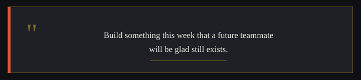

<table align="center">
<tr>
<td align="center"></td>
<td align="center"></td>
</tr>
</table>


MIND THE FIRE.

