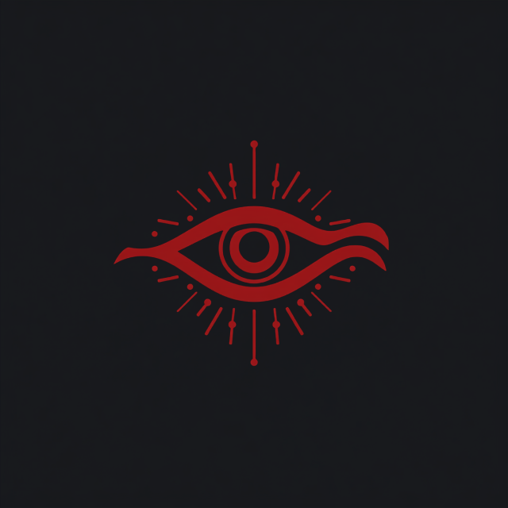

  

  
  

 

  

  <h1>Hi, I’m Mubeen.</h1>

  
<strong>Full-stack builder exploring intelligent systems, resilient interfaces, and software with a point of view.</strong>

  

    I use <code>muxby</code> as a living lab for deliberate engineering: immersive interaction, useful automation, and clean systems that stay understandable as they grow.
  

  
  

 

## The build philosophy

> **Craft over noise.** Strong software should be expressive at the surface, disciplined underneath, and unmistakably useful in the hands of real people.

I am drawn to products that combine thoughtful visual design with dependable engineering. The work shown here is intentionally shaped around that balance: clear interfaces, adaptable full-stack foundations, and a steady curiosity for AI-assisted tools that reduce friction rather than create it.

| Current focus | Engineering lens | Working style |
| --- | --- | --- |
| **Intelligent products** | Practical AI features, automation, and human-centered workflows | Design deliberately, build in small reliable steps, and refine where it matters |
| **Full-stack systems** | Maintainable front ends, pragmatic back ends, and clean data flows | Prefer explicit trade-offs over accidental complexity |
| **Immersive web experiences** | Motion, visual hierarchy, performance, and accessible interaction | Make the experience memorable without letting presentation obscure the product |

## Core arsenal

  

 

  
  
  
  

## Featured build

  

### `muxby/muxby` — a profile built like a product

This repository is the active profile system behind this page. It pairs GitHub-native Markdown with lightweight SVG assets, a focused visual language, and deliberately selected live widgets. The goal is not to treat a profile README as a résumé in disguise; it is to use the format as a compact demonstration of taste, iteration, and technical care.

| Signature element | Why it is here |
| --- | --- |
| **Crimson dragon hero** | Establishes a cinematic visual signature immediately, using an animated GIF that GitHub renders natively. |
| **Custom rune and ember dividers** | Create rhythm and hierarchy without overwhelming the content or relying on heavy page chrome. |
| **Live GitHub modules** | Keep the profile connected to real activity rather than manually maintained vanity metrics. |

## Signal from GitHub

  
  

 

  

 

  <picture>
    <source media="(prefers-color-scheme: light)" srcset="https://raw.githubusercontent.com/muxby/muxby/output/github-contribution-grid-snake.svg" />
    
  </picture>

## Open channel

I welcome conversations around full-stack product work, applied AI, creative developer tooling, and ambitious ideas that need careful implementation. If you have a project with a real problem to solve, I would be glad to hear what you are building.

  
  

 

  

  <code>OBSERVATION: the future is not predicted — it is committed, tested, and shipped.</code>

