<!-- ════════════════════════════════════════════════════════════════════════ -->
<!-- ║                                                                      ║ -->
<!-- ║   M U X B Y   ·   D I G I T A L   M A S T E R P I E C E   v ∞        ║ -->
<!-- ║                                                                      ║ -->
<!-- ║   A sci-fi operating system booting up inside a Markdown file.       ║ -->
<!-- ║   Designed & engineered in the void.                                 ║ -->
<!-- ║                                                                      ║ -->
<!-- ║   CUSTOMIZE: search for "muxby" to swap in your own username,        ║ -->
<!-- ║   and see SETUP.md for the full find-and-replace map.                ║ -->
<!-- ║                                                                      ║ -->
<!-- ════════════════════════════════════════════════════════════════════════ -->

<!-- ══════ SECTION 01 : CINEMATIC BOOT SEQUENCE ══════ -->

<div align="center">

<!-- ── 01.1 · Full-width animated nebula banner (custom SVG) ── -->

</div>

<!-- ── 01.2 · OS boot log ── -->

```console
 ┌──────────────────────────────────────────────────────────────┐
 │  MUXBY-OS v5.0.1 — "NEON VOID" KERNEL                        │
 ├──────────────────────────────────────────────────────────────┤
 │  > INITIALIZING NEURAL INTERFACE...................... [OK]  │
 │  > LOADING CREATIVE ENGINE v∞......................... [OK]  │
 │  > MOUNTING /dev/imagination.......................... [OK]  │
 │  > CALIBRATING CAFFEINE INJECTORS..................... [OK]  │
 │  > COMPILING DREAMS INTO SOFTWARE..................... [OK]  │
 │  > ESTABLISHING UPLINK TO github.com/muxby............ [OK]  │
 │  > WELCOME, VISITOR. IDENTITY CONFIRMED: HUMAN ✔             │
 └──────────────────────────────────────────────────────────────┘
```

<!-- ── 01.3 · Multi-line typing animation ── -->

<div align="center">


<!-- ── 01.4 · Holographic identity card ── -->

<table>
<tr>
<td align="center" width="180">

<br/>

</td>
<td width="440">

<h3 align="center">⬡ &nbsp;H O L O G R A P H I C &nbsp; I D · C A R D&nbsp; ⬡</h3>

<table width="100%">
<tr><td><code>DESIGNATION</code></td><td><b>MUXBY</b></td></tr>
<tr><td><code>CALLSIGN</code></td><td><i>"The Void Architect"</i></td></tr>
<tr><td><code>ROLE</code></td><td>Creative Software Engineer · AI Developer</td></tr>
<tr><td><code>COORDINATES</code></td><td>𝟒𝟏.𝟎𝟎𝟖𝟐° 𝐍 · 𝟐𝟖.𝟗𝟕𝟖𝟒° 𝐄 · Planet Earth (mostly)</td></tr>
<tr><td><code>STATUS</code></td><td>🟢 <b>ONLINE — BUILDING THE FUTURE</b></td></tr>
<tr><td><code>THREAT LEVEL</code></td><td>Only to badly written legacy code</td></tr>
</table>

</td>
</tr>
</table>

<!-- ── 01.5 · Floating tech icons (orbit row) ── -->


<!-- ── 01.6 · Signature quote ── -->


<!-- ── 01.7 · Social proof HUD strip ── -->


&nbsp;

&nbsp;


</div>


<!-- ══════ SECTION 02 : IDENTITY MATRIX ══════ -->

<div align="center">


<i>SELECT YOUR CHARACTER — all eight are the same person. That's the trick.</i>

<br/><br/>

<!-- character-select grid: 4 × 2 class cards -->
<table>
<tr>
<td align="center" width="25%">
<h3>🎨</h3>
<b>CREATIVE ENGINEER</b><br/>
<sub><i>« The Architect of Experiences »</i></sub><br/><br/>
<sub>⚡ Turns blank screens into places people want to live</sub><br/><br/>
<code>CREATIVITY ▓▓▓▓▓▓▓▓▓░ 95%</code>
</td>
<td align="center" width="25%">
<h3>🤖</h3>
<b>AI DEVELOPER</b><br/>
<sub><i>« The Machine Whisperer »</i></sub><br/><br/>
<sub>⚡ Convinces matrices to hold opinions</sub><br/><br/>
<code>NEURAL AFFINITY ▓▓▓▓▓▓▓▓▓░ 92%</code>
</td>
<td align="center" width="25%">
<h3>🌐</h3>
<b>FULL STACK DEV</b><br/>
<sub><i>« Master of Both Realms »</i></sub><br/><br/>
<sub>⚡ Crosses the client/server border without a passport</sub><br/><br/>
<code>RANGE ▓▓▓▓▓▓▓▓░░ 88%</code>
</td>
<td align="center" width="25%">
<h3>⚙️</h3>
<b>BACKEND ENGINEER</b><br/>
<sub><i>« Guardian of the Server Room »</i></sub><br/><br/>
<sub>⚡ Hears a failing health check in his sleep</sub><br/><br/>
<code>RELIABILITY ▓▓▓▓▓▓▓▓▓▓ 99.99%</code>
</td>
</tr>
<tr>
<td align="center">
<h3>🏗️</h3>
<b>SYSTEM DESIGNER</b><br/>
<sub><i>« The Blueprint Mind »</i></sub><br/><br/>
<sub>⚡ Sees the diagram before the whiteboard exists</sub><br/><br/>
<code>FORESIGHT ▓▓▓▓▓▓▓▓▓░ 90%</code>
</td>
<td align="center">
<h3>🧩</h3>
<b>PROBLEM SOLVER</b><br/>
<sub><i>« Debugger of Reality »</i></sub><br/><br/>
<sub>⚡ Bisects any disaster down to one bad commit</sub><br/><br/>
<code>PERSISTENCE ▓▓▓▓▓▓▓▓▓▓ 100%</code>
</td>
<td align="center">
<h3>💚</h3>
<b>OSS ENTHUSIAST</b><br/>
<sub><i>« Citizen of the Commons »</i></sub><br/><br/>
<sub>⚡ Leaves every codebase better than found</sub><br/><br/>
<code>GENEROSITY ▓▓▓▓▓▓▓▓▓░ 93%</code>
</td>
<td align="center">
<h3>🔭</h3>
<b>TECH EXPLORER</b><br/>
<sub><i>« Cartographer of the Unknown »</i></sub><br/><br/>
<sub>⚡ Reads changelogs the way others read novels</sub><br/><br/>
<code>CURIOSITY ▓▓▓▓▓▓▓▓▓▓ ∞%</code>
</td>
</tr>
</table>

</div>


<!-- ══════ SECTION 03 : THE ORIGIN STORY ══════ -->

<div align="center">


<sub><code>MISSION LOG · DECRYPTED · EYES ONLY</code></sub>

</div>

<br/>

<!-- vertical mission-log timeline -->
<table>
<tr>
<td align="center" width="110"><h3>🌱</h3><b><code>ACT I</code></b></td>
<td>
<b>THE SPARK</b><br/>
<sub>A borrowed laptop, a blinking cursor, and the discovery that typing the right words makes machines obey.
Most kids wanted a magic wand. I realized I already had one — it just needed semicolons.</sub>
</td>
</tr>
<tr><td align="center">┃<br/>┃</td><td></td></tr>
<tr>
<td align="center"><h3>⚔️</h3><b><code>ACT II</code></b></td>
<td>
<b>THE GRIND</b><br/>
<sub>Years of stack traces at 2 AM. Projects that collapsed under their own ambition, rebuilt smaller, smarter, sharper.
I didn't learn to code from tutorials — I learned from the wreckage of my own beautiful mistakes.</sub>
</td>
</tr>
<tr><td align="center">┃<br/>┃</td><td></td></tr>
<tr>
<td align="center"><h3>🚀</h3><b><code>ACT III</code></b></td>
<td>
<b>LIFTOFF</b><br/>
<sub>The first project a stranger actually used. The first pull request merged into someone else's dream.
Somewhere between those two moments, a hobby quietly became a calling.</sub>
</td>
</tr>
<tr><td align="center">┃<br/>┃</td><td></td></tr>
<tr>
<td align="center"><h3>🧠</h3><b><code>ACT IV</code></b></td>
<td>
<b>THE AI AWAKENING</b><br/>
<sub>Then the machines started talking back. I fell into machine learning the way you fall into a black hole —
slowly at first, then all at once, and now I build software that learns faster than I do.</sub>
</td>
</tr>
<tr><td align="center">┃<br/>┃</td><td></td></tr>
<tr>
<td align="center"><h3>🎯</h3><b><code>MISSION</code></b></td>
<td>
<sub>To build systems so thoughtfully engineered they feel inevitable — tools people stop noticing because
they simply work, every time, everywhere.</sub>
</td>
</tr>
<tr><td align="center">┃<br/>┃</td><td></td></tr>
<tr>
<td align="center"><h3>🧭</h3><b><code>PHILOSOPHY</code></b></td>
<td>
<sub>Complexity is a loan you take out against your future self. Ship simple. Refactor fearlessly.
Leave elegance in every file you touch.</sub>
</td>
</tr>
<tr><td align="center">┃<br/>┃</td><td></td></tr>
<tr>
<td align="center"><h3>🔥</h3><b><code>NOW</code></b></td>
<td>
<b>CURRENT OBSESSION</b><br/>
<sub>Autonomous AI agents — software that plans, acts, fails, retries, and improves without being told to.
Teaching code to want things is the strangest job description I've ever written.</sub>
</td>
</tr>
<tr><td align="center">┃<br/>┃</td><td></td></tr>
<tr>
<td align="center"><h3>🌌</h3><b><code>NEXT</code></b></td>
<td>
<b>FUTURE VISION</b> &nbsp;<sub><i>(read in a movie-trailer voice)</i></sub><br/>
<sub>In a world drowning in software… one engineer builds the kind that thinks.
This decade: intelligent systems that amplify human creativity instead of replacing it.
<b>Coming soon to a production environment near you.</b></sub>
</td>
</tr>
</table>


<!-- ══════ SECTION 04 : THE SKILL NEXUS ══════ -->

<div align="center">


<sub><code>COMMAND CENTER · ALL PANELS NOMINAL</code></sub>

</div>

<br/>

<table>
<tr>
<td width="50%" valign="top">

<h4 align="center">💻 PROGRAMMING LANGUAGES</h4>
<div align="center">


<code>POWER ▓▓▓▓▓▓▓▓▓░ 95%</code>
</div>

</td>
<td width="50%" valign="top">

<h4 align="center">🎨 FRONTEND</h4>
<div align="center">


<code>POWER ▓▓▓▓▓▓▓▓░░ 85%</code>
</div>

</td>
</tr>
<tr>
<td valign="top">

<h4 align="center">⚙️ BACKEND</h4>
<div align="center">


<code>POWER ▓▓▓▓▓▓▓▓▓░ 95%</code>
</div>

</td>
<td valign="top">

<h4 align="center">🗄️ DATABASES</h4>
<div align="center">


<code>POWER ▓▓▓▓▓▓▓▓░░ 88%</code>
</div>

</td>
</tr>
<tr>
<td valign="top">

<h4 align="center">☁️ CLOUD &amp; INFRASTRUCTURE</h4>
<div align="center">


<code>POWER ▓▓▓▓▓▓▓▓░░ 80%</code>
</div>

</td>
<td valign="top">

<h4 align="center">🤖 AI &amp; LLMs</h4>
<div align="center">


<code>POWER ▓▓▓▓▓▓▓▓▓░ 92%</code>
</div>

</td>
</tr>
<tr>
<td valign="top">

<h4 align="center">🧠 MACHINE LEARNING &nbsp;·&nbsp; 📊 DATA SCIENCE</h4>
<div align="center">


<code>POWER ▓▓▓▓▓▓▓▓░░ 85%</code>
</div>

</td>
<td valign="top">

<h4 align="center">🛡️ CYBERSECURITY &nbsp;·&nbsp; 🔄 DEVOPS &amp; CI/CD</h4>
<div align="center">


<code>POWER ▓▓▓▓▓▓▓░░░ 75%</code>
</div>

</td>
</tr>
<tr>
<td valign="top">

<h4 align="center">🐧 OS &nbsp;·&nbsp; 🧰 TOOLS</h4>
<div align="center">


<code>POWER ▓▓▓▓▓▓▓▓▓░ 90%</code>
</div>

</td>
<td valign="top">

<h4 align="center">🧪 TESTING &nbsp;·&nbsp; 📐 ARCHITECTURE</h4>
<div align="center">


<code>POWER ▓▓▓▓▓▓▓▓░░ 85%</code>
</div>

</td>
</tr>
</table>

<br/>

<div align="center">

<!-- ── 04.x · Radar chart + Signature Stack ── -->
<table>
<tr>
<td align="center" width="50%">
</td>
<td valign="top" width="50%">

<h4 align="center">⭐ SIGNATURE STACK</h4>
<sub><i>The five that define me:</i></sub>

<table width="100%">
<tr><td>🐍</td><td><b>Python</b></td><td><sub>my native tongue — from scripts to production ML</sub></td></tr>
<tr><td>⚛️</td><td><b>TypeScript + React</b></td><td><sub>where interfaces stop being screens and start being places</sub></td></tr>
<tr><td>🔥</td><td><b>PyTorch</b></td><td><sub>the forge where the intelligent parts get made</sub></td></tr>
<tr><td>🐘</td><td><b>PostgreSQL</b></td><td><sub>the one database I'd trust with my diary</sub></td></tr>
<tr><td>☸️</td><td><b>Kubernetes</b></td><td><sub>because good software deserves to survive bad days</sub></td></tr>
</table>

</td>
</tr>
</table>

</div>


<!-- ══════ SECTION 05 : ANIMATED TECH CONSTELLATION ══════ -->

<div align="center">


<!-- ── 05.1 · Custom constellation map (SVG starfield) ── -->

<br/><br/>

<!-- ── 05.2 · Scrolling badge belts ── -->

<br/>


<br/><br/>

<!-- ── 05.3 · Technology trading cards (rarity tiers) ── -->
<h4>◈ COLLECTOR'S EDITION — TECH TRADING CARDS ◈</h4>

<table>
<tr>
<td align="center" width="20%">
🟨 <b>LEGENDARY</b>
<h3>🐍</h3>
<b>PYTHON</b><br/>
<sub>⏳ 9 yrs · ⚡ 95%</sub><br/><br/>
<sub><i>"Started as a hobby, became a personality."</i></sub>
</td>
<td align="center" width="20%">
🟨 <b>LEGENDARY</b>
<h3>🔥</h3>
<b>PYTORCH</b><br/>
<sub>⏳ 5 yrs · ⚡ 90%</sub><br/><br/>
<sub><i>"Deals fire damage to unsolved problems."</i></sub>
</td>
<td align="center" width="20%">
🟪 <b>EPIC</b>
<h3>⚛️</h3>
<b>REACT</b><br/>
<sub>⏳ 6 yrs · ⚡ 88%</sub><br/><br/>
<sub><i>"Re-renders reality when state changes."</i></sub>
</td>
<td align="center" width="20%">
🟦 <b>RARE</b>
<h3>☸️</h3>
<b>KUBERNETES</b><br/>
<sub>⏳ 4 yrs · ⚡ 80%</sub><br/><br/>
<sub><i>"Summons three replicas of any fallen ally."</i></sub>
</td>
<td align="center" width="20%">
⬜ <b>COMMON</b>
<h3>📟</h3>
<b>BASH</b><br/>
<sub>⏳ 9 yrs · ⚡ 85%</sub><br/><br/>
<sub><i>"Common rarity. Uncommon power. Handle with quotes."</i></sub>
</td>
</tr>
</table>

</div>


<!-- ══════ SECTION 06 : MISSION CONTROL ══════ -->

<div align="center">


<sub><code>HOUSTON, WE HAVE TELEMETRY · ALL SYSTEMS GREEN</code></sub>

<br/><br/>

<!-- ── 06.1 · Primary flight instruments ── -->
<table>
<tr>
<td align="center" width="50%">
<sub><code>🧮 CORE TELEMETRY</code></sub><br/>

</td>
<td align="center" width="50%">
<sub><code>🔥 CONSECUTIVE FLIGHT DAYS</code></sub><br/>

</td>
</tr>
<tr>
<td align="center">
<sub><code>🧬 CODE DNA ANALYSIS</code></sub><br/>

</td>
<td align="center">
<sub><code>⏱️ HOURS IN THE MATRIX (WakaTime)</code></sub><br/>
<!-- Connect wakatime.com and uncomment:

-->
<br/><code>▓▓▓▓▓▓▓▓▓▓▓▓▓▓▓▓ TRACKING…</code><br/>
<sub><i>time dilation detected near deadline horizons</i></sub><br/><br/>
</td>
</tr>
</table>

<!-- ── 06.2 · Signal transmission log ── -->
<sub><code>📡 SIGNAL TRANSMISSION LOG</code></sub><br/>


<!-- ── 06.3 · Profile summary cards ── -->
<sub><code>🛰️ ORBITAL SUMMARY ARRAY</code></sub><br/>

<table>
<tr>
<td></td>
<td></td>
</tr>
<tr>
<td></td>
<td></td>
</tr>
</table>

<!-- ── 06.4 · Hall of achievements ── -->
<sub><code>🏆 HALL OF ACHIEVEMENTS</code></sub><br/>


<!-- ── 06.5 · Metrics readout row ── -->


<br/><br/>

<!-- ── 06.6 · The contribution snake ── -->
<sub><code>🐍 SPECIMEN 001 — FEEDS EXCLUSIVELY ON COMMITS</code></sub><br/><br/>
<picture>
  <source media="(prefers-color-scheme: dark)" srcset="https://raw.githubusercontent.com/muxby/muxby/output/github-contribution-grid-snake-dark.svg"/>
  <source media="(prefers-color-scheme: light)" srcset="https://raw.githubusercontent.com/muxby/muxby/output/github-contribution-grid-snake.svg"/>
  
</picture>

</div>


<!-- ══════ SECTION 06½ : THE OBSERVATORY — LIVE TELEMETRY DECK ══════ -->
<!-- Every chart below is a hand-built, SMIL-animated SVG. No libraries.  -->
<!-- No JavaScript. Just geometry, patience, and an unhealthy love of     -->
<!-- stroke-dasharray. Edit values directly inside assets/graph-*.svg.    -->

<div align="center">

<!-- ── 06½.1 · Aurora header (custom SVG) ── -->

<sub><code>DOME OPEN · SKIES CLEAR · EVERY CHART BELOW IS HAND-BUILT SVG — ZERO LIBRARIES, ZERO JS</code></sub>

<br/><br/>

<!-- ── 06½.2 · Cockpit gauge cluster ── -->

<br/><br/>

<!-- ── 06½.3 · Code DNA donut + Skill equalizer ── -->
<table>
<tr>
<td align="center" width="50%">
</td>
<td align="center" width="50%">
</td>
</tr>
</table>

<!-- ── 06½.4 · XP timeline ── -->


<br/><br/>

<!-- ── 06½.5 · Energy grid + Circadian clock ── -->
<table>
<tr>
<td align="center" width="58%">
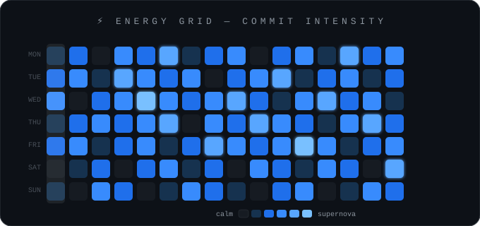
</td>
<td align="center" width="42%">
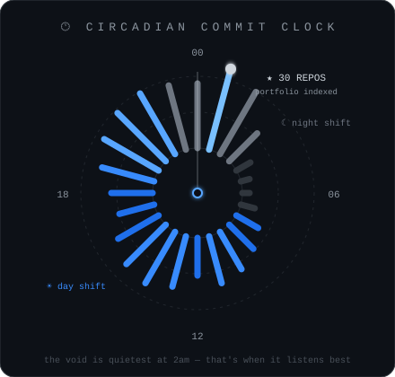
</td>
</tr>
</table>

<sub><i>Observatory findings: output peaks at 01:47 AM, spikes on Wednesdays, and correlates strongly with synthwave BPM.</i></sub>

</div>


<!-- ══════ SECTION 07 : THE 3D GALLERY ══════ -->

<div align="center">


<sub><i>Depth is an illusion. So is the deadline. Only the glow is real.</i></sub>

<br/><br/>

<!-- ── 07.1 · Hologram projector (custom SVG) + isometric cubes ── -->
<table>
<tr>
<td align="center" width="55%">
<sub><code>HOLOGRAM PROJECTOR MK.IV — projecting featured build</code></sub>
</td>
<td align="center" width="45%" valign="middle">

<!-- isometric skill cubes, hand-carved from unicode -->
<pre>
      ▄▄▄▄▄▄▄
    ▄█▓▒░PY░▒▓█▄        FRONT: shipped
   ██▓▒░░░░░▒▓██        LEFT:  tested
    ▀█▓▒░░░▒▓█▀         TOP:   documented
      ▀▀▀▀▀▀▀           (all sides load-bearing)

   ┌───────────┐
   │  ╱▔▔▔▔▔╱│ │
   │ ╱  TS  ╱ │ │   an isometric cube
   │▕▁▁▁▁▁▁▏ ╱  │   rendered in pure
   │▕▁▁▁▁▁▁▏╱   │   monospace stubbornness
   └───────────┘
</pre>

</td>
</tr>
</table>

<!-- ── 07.2 · The commit mountains (3D contribution graph) ── -->
<sub><code>🗻 THE COMMIT MOUNTAINS — TOPOGRAPHIC SURVEY</code></sub><br/><br/>


<br/>

<!-- ── 07.3 · Floating depth cards ── -->
<table>
<tr>
<td align="center" width="33%">
<br/>
▛▀▀▀▀▀▀▀▀▀▀▀▀▀▀▜<br/>
▌ &nbsp;💠 LAYER 01&nbsp; ▐<br/>
▌ &nbsp;<b>INTERFACE</b>&nbsp; ▐<br/>
▙▄▄▄▄▄▄▄▄▄▄▄▄▄▄▟<br/>
<sub>░░ shadow depth: 4px ░░</sub><br/><br/>
</td>
<td align="center" width="33%">
<br/>
▛▀▀▀▀▀▀▀▀▀▀▀▀▀▀▜<br/>
▌ &nbsp;💠 LAYER 02&nbsp; ▐<br/>
▌ &nbsp;<b>LOGIC CORE</b>&nbsp; ▐<br/>
▙▄▄▄▄▄▄▄▄▄▄▄▄▄▄▟<br/>
<sub>░░░ shadow depth: 8px ░░░</sub><br/><br/>
</td>
<td align="center" width="33%">
<br/>
▛▀▀▀▀▀▀▀▀▀▀▀▀▀▀▜<br/>
▌ &nbsp;💠 LAYER 03&nbsp; ▐<br/>
▌ &nbsp;<b>DATA ABYSS</b>&nbsp; ▐<br/>
▙▄▄▄▄▄▄▄▄▄▄▄▄▄▄▟<br/>
<sub>░░░░ shadow depth: ∞ ░░░░</sub><br/><br/>
</td>
</tr>
</table>

</div>


<!-- ══════ SECTION 08 : THE SHOWCASE HANGAR ══════ -->

<div align="center">


<sub><code>BAY DOORS OPEN · 4 VESSELS DOCKED · 2 PROTOTYPES IN THE LAB</code></sub>

</div>

<br/>

<!-- ═══ HANGAR BAY 01 ═══ -->
<!-- CUSTOMIZE: replace repo names, links, and blurbs with your real projects -->
<table>
<tr>
<td width="55%">

<h3>🚀 CODENAME: <code>NEBULA-ENGINE</code></h3>
<sub>🏷️ <code>MISSION CLASSIFICATION: CLASS-S PROJECT</code> · 🟢 <b>STATUS: LIVE</b></sub>

<blockquote><i>"Some engines run on fuel. This one runs on ideas."</i></blockquote>

An AI-powered creative engine that turns natural-language briefs into production-ready design systems.

✨ <b>Key features</b>
<ul>
<sub>
<li>🧠 LLM-driven component generation with taste</li>
<li>🎨 Theme synthesis from a single brand color</li>
<li>⚡ Sub-second hot-reload preview pipeline</li>
<li>🔌 Plugin API for custom generators</li>
</sub>
</ul>

🧱 <sub><b>Architecture:</b> Event-driven microservices · Redis Streams · K8s</sub><br/>
📈 <sub><b>Difficulty:</b> ▰▰▰▰▱</sub> &nbsp; 🗺️ <sub><b>Next up:</b> multiplayer editing</sub>

</td>
<td width="45%" align="center">


<br/><br/>

<a href="https://github.com/muxby"></a>
<a href="https://github.com/muxby"></a>
<a href="https://github.com/muxby"></a>

</td>
</tr>
</table>

<!-- ═══ HANGAR BAY 02 ═══ -->
<table>
<tr>
<td width="45%" align="center">


<br/><br/>

<a href="https://github.com/muxby"></a>
<a href="https://github.com/muxby"></a>

</td>
<td width="55%">

<h3 align="right">🛰️ CODENAME: <code>SENTINEL-7</code></h3>
<div align="right"><sub>🟢 <b>STATUS: LIVE</b> · 🏷️ <code>MISSION CLASSIFICATION: CLASS-A PROJECT</code></sub></div>

<blockquote><i>"It watches your services so you can watch the sunset."</i></blockquote>

A self-healing observability agent: anomaly detection, root-cause hints, and automated remediation for distributed systems.

✨ <b>Key features</b>
<ul>
<sub>
<li>📡 Zero-config service discovery</li>
<li>🧬 Statistical + ML anomaly detection</li>
<li>🔧 Safe, reversible auto-remediation playbooks</li>
<li>🗣️ Incident summaries written in plain human</li>
</sub>
</ul>

🧱 <sub><b>Architecture:</b> Agent mesh · gRPC · time-series pipeline</sub><br/>
📈 <sub><b>Difficulty:</b> ▰▰▰▰▰</sub> &nbsp; 🗺️ <sub><b>Next up:</b> eBPF deep-tracing</sub>

</td>
</tr>
</table>

<!-- ═══ HANGAR BAY 03 ═══ -->
<table>
<tr>
<td width="55%">

<h3>🧠 CODENAME: <code>ORACLE-RAG</code></h3>
<sub>🏷️ <code>MISSION CLASSIFICATION: CLASS-A PROJECT</code> · 🛠️ <b>STATUS: IN DEVELOPMENT</b></sub>

<blockquote><i>"Every company has answers buried somewhere. This digs."</i></blockquote>

A retrieval-augmented knowledge engine that turns scattered docs, wikis, and repos into one honest, citable brain.

✨ <b>Key features</b>
<ul>
<sub>
<li>📚 Hybrid search: dense vectors + BM25 + reranking</li>
<li>🔍 Answers with receipts — every claim cited</li>
<li>🧊 Cold-start ingestion of 100k docs in minutes</li>
<li>🛡️ Permission-aware retrieval (no leaked secrets)</li>
</sub>
</ul>

🧱 <sub><b>Architecture:</b> pgvector · streaming ETL · LLM orchestration</sub><br/>
📈 <sub><b>Difficulty:</b> ▰▰▰▰▱</sub> &nbsp; 🗺️ <sub><b>Next up:</b> multi-hop reasoning</sub>

</td>
<td width="45%" align="center">


<br/><br/>

<a href="https://github.com/muxby"></a>
<a href="https://github.com/muxby"></a>

</td>
</tr>
</table>

<!-- ═══ HANGAR BAY 04 ═══ -->
<table>
<tr>
<td width="45%" align="center">


<br/><br/>

<a href="https://github.com/muxby"></a>
<a href="https://github.com/muxby"></a>

</td>
<td width="55%">

<h3 align="right">🎮 CODENAME: <code>PIXELFORGE</code></h3>
<div align="right"><sub>🧪 <b>STATUS: EXPERIMENTAL</b> · 🏷️ <code>MISSION CLASSIFICATION: CLASS-B PROJECT</code></sub></div>

<blockquote><i>"A game engine small enough to read, fun enough to lose a weekend to."</i></blockquote>

A minimalist 2D game engine for the browser — ECS core, pixel-perfect renderer, and a level editor that runs in a URL.

✨ <b>Key features</b>
<ul>
<sub>
<li>🧩 Entity-Component-System in &lt; 2k lines</li>
<li>🖼️ Deterministic pixel renderer (no jitter, ever)</li>
<li>🎵 Chiptune audio synth built on WebAudio</li>
<li>💾 Levels serialized into shareable links</li>
</sub>
</ul>

🧱 <sub><b>Architecture:</b> ECS · requestAnimationFrame loop · zero deps</sub><br/>
📈 <sub><b>Difficulty:</b> ▰▰▰▱▱</sub> &nbsp; 🗺️ <sub><b>Next up:</b> co-op netcode</sub>

</td>
</tr>
</table>

<!-- ═══ EXPERIMENTAL LAB STRIP ═══ -->
<div align="center">

<h4>🔬 THE EXPERIMENTAL LAB — <sub><i>small vessels, big ideas</i></sub></h4>

<table>
<tr>
<td align="center" width="33%">
🧪 <b><code>whisper-cli</code></b><br/>
<sub>Terminal voice notes → tidy markdown</sub><br/>
<sub>🧪 EXPERIMENTAL · ▰▰▱▱▱</sub>
</td>
<td align="center" width="33%">
🧪 <b><code>git-haiku</code></b><br/>
<sub>Commits summarized as haiku. Yes, really.</sub><br/>
<sub>🧪 EXPERIMENTAL · ▰▱▱▱▱</sub>
</td>
<td align="center" width="33%">
🏛️ <b><code>void-theme</code></b><br/>
<sub>The Neon Void palette for every editor</sub><br/>
<sub>🏛️ ARCHIVED · ▰▰▱▱▱</sub>
</td>
</tr>
</table>

</div>


<!-- ══════ SECTION 09 : THE AI LABORATORY ══════ -->

<div align="center">

<!-- glitch entry banner (custom SVG) -->


</div>

<br/>

<!-- lab stations grid -->
<table>
<tr>
<td align="center" width="33%">🗣️ <b>LARGE LANGUAGE MODELS</b><br/><sub><i>"Teaching machines to speak human."</i></sub></td>
<td align="center" width="33%">🎨 <b>GENERATIVE AI</b><br/><sub><i>"Where math dreams in color."</i></sub></td>
<td align="center" width="33%">👁️ <b>COMPUTER VISION</b><br/><sub><i>"Giving silicon the gift of sight."</i></sub></td>
</tr>
<tr>
<td align="center">📝 <b>NLP</b><br/><sub><i>"Decoding the human protocol."</i></sub></td>
<td align="center">📚 <b>RAG SYSTEMS</b><br/><sub><i>"Memory augmentation for machines."</i></sub></td>
<td align="center">🤖 <b>AUTONOMOUS AGENTS</b><br/><sub><i>"Software that acts on its own."</i></sub></td>
</tr>
<tr>
<td align="center">🎯 <b>PROMPT ENGINEERING</b><br/><sub><i>"The art of speaking to gods politely."</i></sub></td>
<td align="center">🔧 <b>FINE-TUNING</b><br/><sub><i>"Sculpting intelligence."</i></sub></td>
<td align="center">🧮 <b>EMBEDDINGS &amp; VECTOR DBs</b><br/><sub><i>"Mapping meaning into space."</i></sub></td>
</tr>
<tr>
<td align="center">🔌 <b>MCP &amp; TOOL USE</b><br/><sub><i>"Wiring AI into the real world."</i></sub></td>
<td align="center">⚙️ <b>AI AUTOMATION PIPELINES</b><br/><sub><i>"Self-driving workflows."</i></sub></td>
<td align="center">🧑‍🔬 <b>STATION 12 — VACANT</b><br/><sub><i>"Reserved for whatever comes next."</i></sub></td>
</tr>
</table>

<br/>

<!-- experiment log terminal -->

```console
muxby@neural-lab:~$ tail -f /var/log/experiments.log
[04:12:07] EXP-0198  fine-tune: loss 0.023 ▼   status: promising
[04:26:41] EXP-0199  agent-swarm: 4 agents negotiated an API contract unsupervised
[04:31:02] EXP-0199  NOTE: they also renamed all my variables. reviewing trust settings.
[05:02:55] EXP-0200  RAG eval: 96.4% citation accuracy — new lab record 🏆
[05:03:12] SYSTEM    coffee reserves at 11%. initiating resupply protocol.
muxby@neural-lab:~$ █
```

<div align="center">

<b>🧪 CURRENT EXPERIMENT:</b> <sub>multi-agent systems that critique each other's code before I ever see it — peer review at machine speed</sub>

<br/><br/>


</div>


<!-- ══════ SECTION 10 : THE DEVELOPER MANIFESTO ══════ -->

<div align="center">


<sub><code>ILLUMINATED MANUSCRIPT · v1.0 · SIGNED IN INK AND ANSI</code></sub>

<br/><br/>

<table width="88%">
<tr><td align="center">

<br/>

<sub>𝐈.</sub> &nbsp;<i>I write code the way architects draw cathedrals — meant to outlive the moment.</i>

<sub>𝐈𝐈.</sub> &nbsp;<i>Clean code isn't vanity; it's a letter of respect to the stranger who inherits it.</i>

<sub>𝐈𝐈𝐈.</sub> &nbsp;<i>Milliseconds are promises. I keep them.</i>

<sub>𝐈𝐕.</sub> &nbsp;<i>I design for the day the traffic graph goes vertical — and smile when it does.</i>

<sub>𝐕.</sub> &nbsp;<i>Creativity is not decoration; it is the load-bearing wall.</i>

<sub>𝐕𝐈.</sub> &nbsp;<i>The best idea in the room doesn't care whose it was. Neither do I.</i>

<sub>𝐕𝐈𝐈.</sub> &nbsp;<i>Users don't read manuals. My interfaces don't require apologies.</i>

<sub>𝐕𝐈𝐈𝐈.</sub> &nbsp;<i>Every technology I don't know yet is just a future version of me waiting.</i>

<sub>𝐈𝐗.</sub> &nbsp;<i>Curiosity is my only unrecoverable dependency.</i>

<sub>𝐗.</sub> &nbsp;<i>Genius ships once. Consistency ships every week. I bet on consistency.</i>

<br/>

</td></tr>
</table>

</div>


<!-- ══════ SECTION 11 : THE SACRED SCROLLS ══════ -->

<div align="center">


<sub><i>Ancient wisdom, version-controlled.</i></sub>

<br/><br/>

<table>
<tr>
<td align="center" width="25%">📜 <b>SOLID</b><br/><sub><i>Five vows that keep castles from becoming sandcastles.</i></sub><br/><sub>😅 <code>// single responsibility: this joke</code></sub></td>
<td align="center" width="25%">📜 <b>KISS</b><br/><sub><i>Complexity flatters the author and punishes everyone else.</i></sub><br/><sub>😅 <code>if (clever) { dont(); }</code></sub></td>
<td align="center" width="25%">📜 <b>DRY</b><br/><sub><i>Say it once, mean it everywhere.</i></sub><br/><sub>😅 <code>// see: DRY. see: DRY.</code></sub></td>
<td align="center" width="25%">📜 <b>YAGNI</b><br/><sub><i>The feature you might need is the bug you already have.</i></sub><br/><sub>😅 <code>delete futureProofing;</code></sub></td>
</tr>
<tr>
<td align="center">🏛️ <b>CLEAN ARCHITECTURE</b><br/><sub><i>Dependencies point inward; ego points nowhere.</i></sub><br/><sub>😅 <code>domain/ has no imports. bliss.</code></sub></td>
<td align="center">🕸️ <b>MICROSERVICES</b><br/><sub><i>Small enough to understand, distributed enough to humble you.</i></sub><br/><sub>😅 <code>1 outage, 12 dashboards</code></sub></td>
<td align="center">♟️ <b>DESIGN PATTERNS</b><br/><sub><i>Old solutions wearing new type signatures.</i></sub><br/><sub>😅 <code>new SingletonFactoryObserver()</code></sub></td>
<td align="center">🧪 <b>TDD</b><br/><sub><i>Write the promise before the product.</i></sub><br/><sub>😅 <code>red → green → refactor → coffee</code></sub></td>
</tr>
<tr>
<td align="center">🛡️ <b>SECURITY-FIRST</b><br/><sub><i>Paranoia, professionally applied.</i></sub><br/><sub>😅 <code>trust: none; verify: all</code></sub></td>
<td align="center">♿ <b>ACCESSIBILITY</b><br/><sub><i>If everyone can't use it, it isn't finished.</i></sub><br/><sub>😅 <code>alt="actually descriptive"</code></sub></td>
<td align="center">⚡ <b>PERFORMANCE BUDGETS</b><br/><sub><i>Every byte pays rent or leaves.</i></sub><br/><sub>😅 <code>bundle.size &lt; ego.size</code></sub></td>
<td align="center">💌 <b>DOCUMENTATION</b><br/><sub><i>Love letters to future me.</i></sub><br/><sub>😅 <code>// dear future me: sorry</code></sub></td>
</tr>
</table>

</div>


<!-- ══════ SECTION 12 : THE LEARNING ODYSSEY ══════ -->

<div align="center">


<!-- metro-map skill tree (custom SVG) -->


<sub><i>Service runs daily. Delays caused by production incidents and particularly good books.</i></sub>

</div>


<!-- ══════ SECTION 13 : THE ARCADE ══════ -->

<!-- 🕹️ KONAMI CODE DETECTED: ↑ ↑ ↓ ↓ ← → ← → B A ... unfortunately GitHub sanitized the 30 extra lives. -->

<div align="center">


<sub><code>INSERT COIN · PLAYER 1 READY · HIGH SCORE: still trying</code></sub>

<br/><br/>

<!-- ── 13.1 · Random dev quote (auto-refreshing) ── -->


<br/>

🌅 <sub><i>Daily motivation: the bug you fix today can't page you tonight.</i></sub>

</div>

<br/>

<!-- ── 13.2 · Fake interactive terminal ── -->

```console
muxby@arcade:~$ whoami
architect of small universes, debugger of large ones

muxby@arcade:~$ sudo hire-me
[sudo] password for visitor: ********
Access granted. Opening transmission channels... 📡 (see Section 15)

muxby@arcade:~$ cat secrets.txt
cat: secrets.txt: Permission denied 😏

muxby@arcade:~$ fortune
"Weeks of coding can save you hours of planning."

muxby@arcade:~$ exit
logout — but the arcade never really closes.
```

<!-- ── 13.2½ · Dev vitals oscilloscope (custom SVG) ── -->

<div align="center">


</div>

<!-- ── 13.3 · ASCII mascot ── -->

```text
        ▄▄▄▄▄▄▄▄▄▄▄
      ▄█▀         ▀█▄        ╔════════════════════════════╗
     ██   ▄▄   ▄▄   ██       ║  V O I D B O T   v 5 . 0   ║
     ██   ██   ██   ██  ...  ║  official mascot of the    ║
     ██      ▄      ██       ║  muxby digital universe    ║
      ██  ▀▄▄▄▄▄▀  ██        ║  hobbies: orbiting, glow   ║
       ▀█▄▄▄▄▄▄▄▄▄█▀         ╚════════════════════════════╝
          ▀▀ ▀▀▀ ▀▀
```

<div align="center">

<!-- ── 13.4 · Stat cabinet ── -->
<table>
<tr>
<td align="center" width="25%">🌡️ <b>MOOD RING</b><br/><br/><code>[ 🟢 FLOW STATE ]</code><br/><sub>recalibrates hourly</sub></td>
<td align="center" width="25%">☕ <b>COFFEE COUNTER</b><br/><br/><code>∞ and counting</code><br/><sub>decaf detected: never</sub></td>
<td align="center" width="25%">🌙 <b>LATE NIGHT METER</b><br/><br/><code>▓▓▓▓▓▓▓▓░░ 82%</code><br/><sub>peak output: 01:47 AM</sub></td>
<td align="center" width="25%">⏳ <b>TIME IN SERVICE</b><br/><br/><code>10 YEARS</code><br/><sub>and still Googling regex</sub></td>
</tr>
<tr>
<td align="center">🐛 <b>BUGS CREATED</b><br/><br/><code>9,742</code><br/><sub>a lifetime body of work</sub></td>
<td align="center">🔨 <b>BUGS FIXED</b><br/><br/><code>9,741</code><br/><sub>we don't talk about #4023</sub></td>
<td align="center">📏 <b>LINES OF CODE</b><br/><br/><code>1,004,822 km… *lines</code><br/><sub>odometer needs service</sub></td>
<td align="center">🎲 <b>RANDOM FACT</b><br/><br/><sub>I once fixed a production bug from a ski lift. The lift was more stable than the service.</sub></td>
</tr>
</table>

<br/>

📖 <b>CURRENTLY READING:</b> <sub><i>Designing Data-Intensive Applications</i> — again. It gets better every re-read.</sub>
&nbsp;·&nbsp;
🎧 <b>NOW PLAYING:</b> <sub>synthwave at 140 BPM <!-- Spotify widget slot: https://spotify-github-profile.kittinanx.com --></sub>

</div>

<!-- 👾 EASTER EGG #1: You found the first secret. The snake in Section 06 is named "Bytey". Tell no one. -->


<!-- ══════ SECTION 14 : OPEN SOURCE GALAXY ══════ -->

<div align="center">


<sub><code>CHARTED SYSTEMS: growing · UNCHARTED: infinite</code></sub>

<br/><br/>

<!-- 🪐 planets: pinned repo cards (swap repo= values for your real repositories) -->
<table>
<tr>
<td align="center" width="50%">
🪐 <sub><code>PLANET 01</code></sub><br/>
<a href="https://github.com/muxby/muxby">

</a>
</td>
<td align="center" width="50%">
🛰️ <sub><code>SATELLITE NETWORK</code></sub><br/><br/>
<br/><br/>
<br/><br/>

</td>
</tr>
</table>

<br/>

<table width="80%">
<tr><td align="center">

<b>🌟 CONTRIBUTION PHILOSOPHY</b>

<sub><i>Open source is the only cathedral built entirely by strangers who never met —
and it still stands. I contribute because every function I publish is a hand extended
across time zones, and because someone once did the same for a confused kid
with a borrowed laptop.</i></sub>

</td></tr>
</table>

<br/>

<b>Want to build together?</b><br/><br/>
<a href="https://github.com/muxby?tab=repositories">

</a>

</div>


<!-- ══════ SECTION 15 : TRANSMISSION CHANNELS ══════ -->

<div align="center">


<sub><code>COMMS CONSOLE ONLINE · ALL FREQUENCIES MONITORED</code></sub>

<br/><br/>

<!-- CUSTOMIZE: replace # with your actual profile links -->
<table>
<tr>
<td align="center" width="20%"><a href="#"></a></td>
<td align="center" width="20%"><a href="#"></a></td>
<td align="center" width="20%"><a href="#"></a></td>
<td align="center" width="20%"><a href="mailto:hello@example.com"></a></td>
<td align="center" width="20%"><a href="#"></a></td>
</tr>
<tr>
<td align="center"><a href="#"></a></td>
<td align="center"><a href="#"></a></td>
<td align="center"><a href="#"></a></td>
<td align="center"><a href="#"></a></td>
<td align="center"><a href="#"></a></td>
</tr>
<tr>
<td align="center"><a href="#"></a></td>
<td align="center"><a href="#"></a></td>
<td align="center"><a href="#"></a></td>
<td align="center"><a href="#"></a></td>
<td align="center"><a href="#"></a></td>
</tr>
</table>

<br/>

<table width="70%">
<tr><td align="center">
⭐ <b>PRIORITY CHANNEL</b> ⭐<br/>
<sub>Fastest route to a reply: <b>Email</b> → average response time: <i>faster than my CI pipeline</i> (a low bar, admittedly)</sub><br/><br/>
<a href="mailto:hello@example.com">

</a>
</td></tr>
</table>

</div>

<!-- 👾 EASTER EGG #2: The coordinates in the ID card point at a café with dangerously good baklava. -->

<!-- ══════ SECTION 16 : THE GRAND FINALE ══════ -->

<div align="center">


<br/>


<br/>

<table width="72%">
<tr><td align="center">
<br/>
<sub>Thank you for scrolling all the way into the void. Most visitors turn back at the hangar.
Whatever brought you here — curiosity, code, or a wrong click — I'm glad the orbit crossed.
Build something this week that your future self will thank you for.</sub>
<br/><br/>
</td></tr>
</table>


<br/>

⭐ <sub><i>If something here made you smile, star something you loved on the way out — stars are how lighthouses find each other.</i></sub>

<br/><br/>


<sub><code>Designed &amp; engineered in the void by muxby — © 2026</code></sub>


</div>

<!-- ════════════════════════════════════════════════════════════════════════ -->
<!--                                                                          -->
<!--   👾 EASTER EGG #3: You read the source. You're my kind of person. 🖤    -->
<!--                                                                          -->
<!--   END OF TRANSMISSION · MUXBY-OS SHUTTING DOWN · SEE YOU IN THE VOID     -->
<!--                                                                          -->
<!-- ════════════════════════════════════════════════════════════════════════ -->
