<div align="center">

<p align="center"><strong>Mubeen</strong></p>

<p align="center"><strong>Creative Software Engineer · AI Developer</strong></p>


[](https://github.com/muxby)
[](https://github.com/muxby)
[](https://github.com/muxby)

</div>


<p><strong>02 — Professional Profile</strong></p>

<table>
<tr>
<td width="25%" align="center">
<b>Creative engineering</b><br/>
<sub>Turning an idea into an experience people want to use.</sub>
</td>
<td width="25%" align="center">
<b>AI development</b><br/>
<sub>Building intelligent systems with grounded, practical outcomes.</sub>
</td>
<td width="25%" align="center">
<b>Full-stack delivery</b><br/>
<sub>Working comfortably from interface details to service boundaries.</sub>
</td>
<td width="25%" align="center">
<b>Systems design</b><br/>
<sub>Designing foundations that stay understandable as products grow.</sub>
</td>
</tr>
<tr>
<td align="center"><b>Backend reliability</b><br/><sub>Healthy services, clear contracts, and operational discipline.</sub></td>
<td align="center"><b>Problem solving</b><br/><sub>Reducing ambiguous problems into useful next decisions.</sub></td>
<td align="center"><b>Open source</b><br/><sub>Learning in public and leaving codebases better than found.</sub></td>
<td align="center"><b>Continuous learning</b><br/><sub>Following the technologies that change how software is made.</sub></td>
</tr>
</table>


<p><strong>03 — Background & Direction</strong></p>

<table>
<tr>
<td width="14%" align="center"><b>01</b></td>
<td><b>Early curiosity</b><br/><sub>A borrowed laptop, a blinking cursor, and the discovery that a carefully written instruction can make a machine do something useful.</sub></td>
</tr>
<tr>
<td align="center"><b>02</b></td>
<td><b>Learning through building</b><br/><sub>Early projects taught the durable lessons: make the first version small, learn from its failures, and return with sharper questions.</sub></td>
</tr>
<tr>
<td align="center"><b>03</b></td>
<td><b>From hobby to craft</b><br/><sub>The first products used by other people made the work more serious—and far more rewarding.</sub></td>
</tr>
<tr>
<td align="center"><b>04</b></td>
<td><b>Applied intelligence</b><br/><sub>Machine learning and agentic systems became a natural extension of product engineering: software that can understand context, help people decide, and improve workflows.</sub></td>
</tr>
<tr>
<td align="center"><b>Now</b></td>
<td><b>Current direction</b><br/><sub>Exploring autonomous and agent-assisted systems that plan, act, recover, and remain accountable to the people who use them.</sub></td>
</tr>
</table>

> **Working principle:** complexity is a cost. The goal is not to make software look sophisticated; it is to make it dependable, legible, and useful.


<p><strong>04 — Technical Strengths</strong></p>

<table>
<tr>
<td width="50%" valign="top">

<p><strong>Languages</strong></p>
<p align="center">


</p>

<p><strong>Frontend</strong></p>
<p align="center">


</p>

<p><strong>Backend & APIs</strong></p>
<p align="center">


</p>

</td>
<td width="50%" valign="top">

<p><strong>Data & Storage</strong></p>
<p align="center">


</p>

<p><strong>Infrastructure</strong></p>
<p align="center">


</p>

<p><strong>AI, ML & Evaluation</strong></p>
<p align="center">


</p>

</td>
</tr>
</table>

<table>
<tr>
<td width="50%" align="center"></td>
<td width="50%">

<p><strong>Core stack</strong></p>

| Technology | How I use it |
|---|---|
| **Python** | From small utilities to production AI and backend workflows. |
| **TypeScript + React** | Product interfaces with strong interaction and maintainability. |
| **PyTorch** | Prototyping and building intelligent system components. |
| **PostgreSQL** | Durable data models and pragmatic querying. |
| **Kubernetes** | Making dependable services survive real operational conditions. |

</td>
</tr>
</table>


<p><strong>05 — Working Toolkit</strong></p>

<p align="center">
  
</p>

<div align="center">
  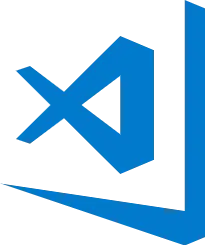
  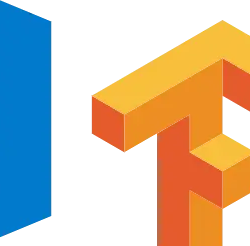
  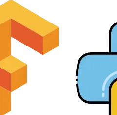
  
  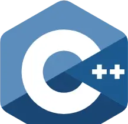
  
  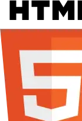
  <br/>
  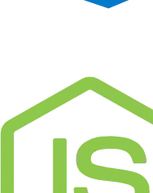
  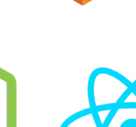
  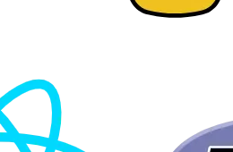
  
  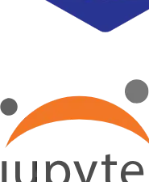
  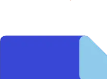
  <br/>
  
  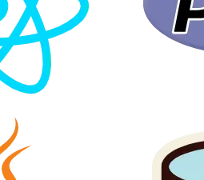
  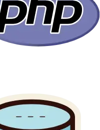
  
</div>

<table>
<tr>
<td align="center" width="20%"><b>Python</b><br/><sub>General-purpose development, automation, data, and AI workflows.</sub></td>
<td align="center" width="20%"><b>PyTorch</b><br/><sub>Experimentation and model-backed product capabilities.</sub></td>
<td align="center" width="20%"><b>TypeScript</b><br/><sub>Reliable product surfaces and service integrations.</sub></td>
<td align="center" width="20%"><b>React</b><br/><sub>Interfaces that communicate clearly and respond gracefully.</sub></td>
<td align="center" width="20%"><b>Kubernetes</b><br/><sub>Operational foundations for services that need to last.</sub></td>
</tr>
</table>


<p><strong>06 — GitHub Activity</strong></p>

<table>
<tr>
<td align="center" width="50%">

</td>
<td align="center" width="50%">

</td>
</tr>
<tr>
<td align="center"></td>
<td align="center"><sub><b>Time tracking</b><br/>Optional WakaTime data can be added here when available.</sub></td>
</tr>
</table>

<p align="center">
  
</p>

<table>
<tr>
<td></td>
<td></td>
</tr>
<tr>
<td></td>
<td></td>
</tr>
</table>

<p align="center">
  
</p>

<picture>
  <source media="(prefers-color-scheme: dark)" srcset="https://raw.githubusercontent.com/muxby/muxby/output/github-contribution-grid-snake-dark.svg"/>
  <source media="(prefers-color-scheme: light)" srcset="https://raw.githubusercontent.com/muxby/muxby/output/github-contribution-grid-snake.svg"/>
  
</picture>


<p><strong>06.5 — Engineering Signals</strong></p>

<p align="center">
  
</p>

These handcrafted SVGs are retained as a visual record of the engineering interests behind the profile: reliability, technology breadth, sustained learning, and a deliberate approach to craft.

<table>
<tr>
<td align="center" width="50%"></td>
<td align="center" width="50%"></td>
</tr>
<tr>
<td align="center"></td>
<td align="center"></td>
</tr>
<tr>
<td align="center"></td>
<td align="center"></td>
</tr>
</table>


<p><strong>07 — Visual Systems</strong></p>

<table>
<tr>
<td width="55%" align="center">
  
</td>
<td width="45%">

<p><strong>Design through implementation</strong></p>

I care about the relationship between visual hierarchy and technical clarity. Good product work brings together the interface, the service contract, the data model, and the operational story—each should reinforce the others.

- **Interface:** designed for attention, context, and accessibility.
- **Logic:** structured for clarity, testing, and predictable change.
- **Data:** modeled for useful questions, not just easy storage.

</td>
</tr>
</table>

<p align="center">
  
</p>


<p><strong>08 — Selected Work</strong></p>

<table>
<tr>
<td width="55%">

<p><strong>Nebula Engine</strong></p>

A concept for an AI-powered creative engine that turns natural-language briefs into production-ready design systems.

- LLM-guided component generation and review.
- Theme synthesis from a concise brand direction.
- Fast visual feedback loops for product teams.
- Extensible integration points for custom generators.

<sub>**Architecture direction:** event-driven services · Redis Streams · Kubernetes</sub>

</td>
<td width="45%" align="center">

<br/>


</td>
</tr>
<tr>
<td width="45%" align="center">

<br/>


</td>
<td width="55%">

<p><strong>Sentinel 7</strong></p>

A self-healing observability concept for distributed systems, combining anomaly signals, explainable root-cause hints, and safe remediation practices.

- Service discovery without excess operational overhead.
- Statistical and model-assisted anomaly detection.
- Reversible remediation playbooks.
- Incident summaries written for people, not dashboards.

<sub>**Architecture direction:** agent mesh · gRPC · time-series pipeline</sub>

</td>
</tr>
<tr>
<td width="55%">

<p><strong>Oracle RAG</strong></p>

A retrieval-augmented knowledge engine designed to make dispersed organisational knowledge easier to find, verify, and use.

- Retrieval with citations and source-aware answers.
- Evaluation loops for quality and regressions.
- Clear access boundaries for sensitive material.
- A workflow designed around human review.

<sub>**Architecture direction:** vector search · Python services · lightweight product interface</sub>

</td>
<td width="45%" align="center">

<br/>


</td>
</tr>
<tr>
<td width="45%" align="center">

<br/>


</td>
<td width="55%">

<p><strong>Atlas</strong></p>

A product concept for turning operational information into clear decisions through shared context, lightweight workflow design, and purposeful analytics.

- Structured inputs that reduce reporting friction.
- A concise view of the decisions that need attention.
- Simple collaboration trails for teams.
- Reporting that values context as much as a metric.

<sub>**Architecture direction:** Next.js · TypeScript · PostgreSQL</sub>

</td>
</tr>
</table>


<p><strong>09 — Applied AI & Research</strong></p>

I am currently interested in multi-agent systems that can critique code, evaluate plans, and provide useful review before work reaches a human teammate. The aim is not novelty for its own sake; it is a more thoughtful and dependable development process.

<p align="center">


</p>


<p><strong>10 — Engineering Principles</strong></p>

<table>
<tr><td align="center">

1. **Build for the next maintainer.** Clear code is a practical form of respect.
2. **Prefer a small honest system to a large fragile one.**
3. **Treat performance, accessibility, and documentation as product work.**
4. **Design for change.** Good boundaries make growth less expensive.
5. **Make ideas testable.** A useful system should explain why it behaves as it does.
6. **Listen for the best idea, not the loudest author.**
7. **Ship consistently.** Great work is the accumulated effect of responsible iterations.

</td></tr>
</table>


<p><strong>11 — Foundations</strong></p>

<table>
<tr>
<td align="center" width="25%"><b>SOLID</b><br/><sub>Responsibilities and dependencies that stay understandable.</sub></td>
<td align="center" width="25%"><b>KISS</b><br/><sub>Clarity is an engineering advantage, not an aesthetic preference.</sub></td>
<td align="center" width="25%"><b>DRY</b><br/><sub>Share stable knowledge; do not duplicate uncertainty.</sub></td>
<td align="center" width="25%"><b>YAGNI</b><br/><sub>Build the capability the product needs, when it needs it.</sub></td>
</tr>
<tr>
<td align="center"><b>Clean architecture</b><br/><sub>Keep the important decisions independent from volatile details.</sub></td>
<td align="center"><b>Microservices</b><br/><sub>Use boundaries deliberately; distributed systems earn their complexity.</sub></td>
<td align="center"><b>Design patterns</b><br/><sub>Use familiar solutions when they make the trade-off clearer.</sub></td>
<td align="center"><b>Test-driven practice</b><br/><sub>Make desired behavior explicit before implementation drifts.</sub></td>
</tr>
<tr>
<td align="center"><b>Security</b><br/><sub>Thoughtful defaults and verification make trust practical.</sub></td>
<td align="center"><b>Accessibility</b><br/><sub>If people cannot use it, the work is incomplete.</sub></td>
<td align="center"><b>Performance budgets</b><br/><sub>Every byte and millisecond should justify itself.</sub></td>
<td align="center"><b>Documentation</b><br/><sub>Good explanations turn local knowledge into team capability.</sub></td>
</tr>
</table>


<p><strong>12 — Learning Path</strong></p>

<p align="center">
  
</p>

The roadmap remains a record of the technologies I am exploring and the areas where I want to deepen my judgement. It is a direction of travel, not a checklist.


<p><strong>13 — Working Notes</strong></p>

<p align="center">
  
</p>

```text
whoami
creative software engineer, systems thinker, persistent debugger

working style
plan clearly → build deliberately → test honestly → document the useful parts

current reading
Designing Data-Intensive Applications — a reliable return point for product and systems thinking

current soundtrack
Focused work, no fixed playlist required
```

<p align="center">
  
</p>

<table>
<tr>
<td align="center" width="25%"><b>Flow state</b><br/><sub>Protected time for concentrated building.</sub></td>
<td align="center" width="25%"><b>Curiosity</b><br/><sub>Questions are treated as productive work.</sub></td>
<td align="center" width="25%"><b>Late work</b><br/><sub>Used carefully, never mistaken for a process.</sub></td>
<td align="center" width="25%"><b>Iteration</b><br/><sub>Consistent refinement outperforms dramatic rewrites.</sub></td>
</tr>
</table>


<p><strong>14 — Open Source</strong></p>

<table>
<tr>
<td align="center" width="50%">
<a href="https://github.com/muxby/muxby">

</a>
</td>
<td width="50%">

<p><strong>Contribution philosophy</strong></p>

Open source is a long conversation between people who may never meet. I value contributions that make software easier to understand, easier to operate, and easier for the next person to improve.

[View repositories →](https://github.com/muxby?tab=repositories)

</td>
</tr>
</table>


<p><strong>15 — Connect</strong></p>

<div align="center">

The contact structure is kept intentionally simple. Scan the relevant QR code to connect on **LinkedIn** or visit the **GitHub** profile.

<table>
<tr>
<td align="center" width="50%">

<p><strong>LinkedIn</strong></p>


<br/>
<sub>Scan to connect on LinkedIn</sub>

</td>
<td align="center" width="50%">

<p><strong>GitHub</strong></p>

<a href="https://github.com/muxby">

</a>

<br/>
<sub><a href="https://github.com/muxby">Scan to visit github.com/muxby</a></sub>

</td>
</tr>
</table>

<br/>

[](#)
[](https://github.com/muxby)
[](mailto:hello@example.com)

</div>


<p><strong>16 — Closing Note</strong></p>

<div align="center">


<br/>

> Build something this week that your future self—and the people who work with you—will be glad exists.


<sub>Designed and maintained by muxby · © 2026</sub>

</div>

<!--
  The original sixteen-section structure and custom asset roles are retained.
  The visual system has been converted from Neon Void / cyberpunk language into
  a restrained editorial portfolio treatment: graphite, navy, steel blue, and bronze.
-->


<div align="center">
  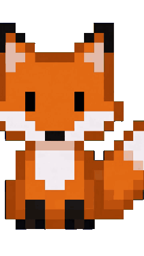
</div>


<div align="center">
  <sub>Thanks for stopping by.</sub>
</div>
